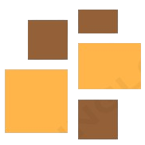
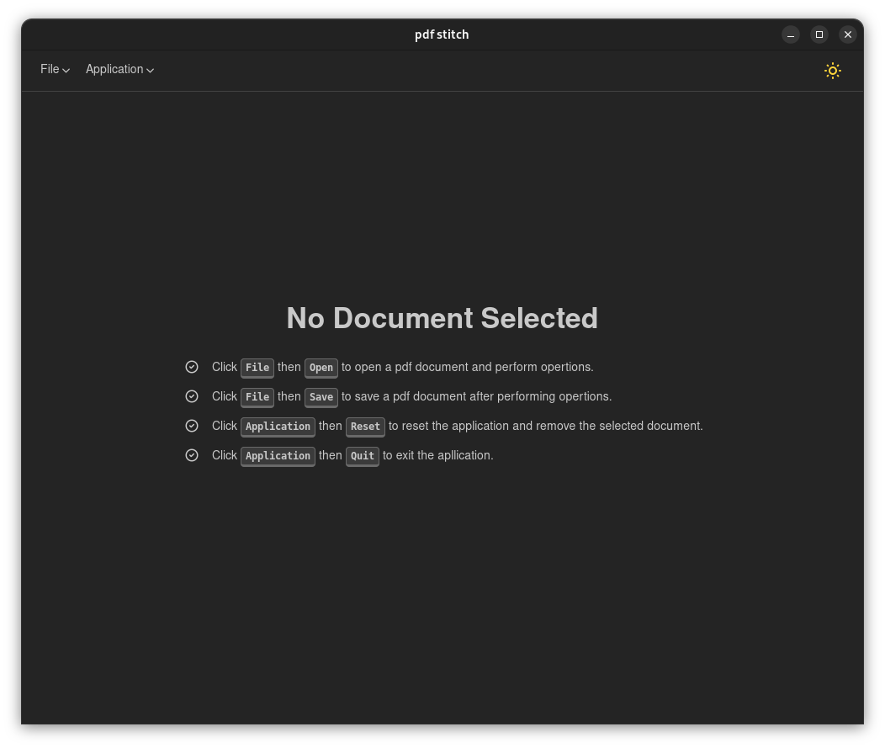

# PDF Stitch

PDF Stitch is a desktop application designed to facilitate the rearrangement and merging of PDF pages with ease. Whether you need to organize, reorder, delete or combine pages from different PDF files, PDF Stitch provides a user-friendly interface to streamline the process.

- The source code for the update server is available at: https://github.com/Ogwenya/tauri-update-server

## Getting Started

### Installation

To use PDF Stitch, follow these steps:

- Download the latest release from the Releases page or from the [landing page](https://pdf-stitch.vercel.app/).
- Install the application on your desktop.
- Open PDF Stitch and start rearranging your PDF pages effortlessly.

### Usage

- Import PDF: click the `File` dropdown in the top left menu, then, select `Open` to select the PDF file you want to edit.
- Rearrange Pages: Drag and drop pages within the application to reorder them according to your preference.
- Preview: Use the preview feature to visualize the changes before saving.
- Save Changes: click the `File` dropdown in the top left menu, then, select `Save` to save the modified PDF with the new page order.

### Features

- Drag and Drop: Rearrange pages effortlessly by dragging and dropping.
- Deleting pages: Click the `x` icon on the top-right of each page to delete it
- Merge PDF documents.
- Intuitive Interface: User-friendly design for easy navigation.
- Theme Toggle: PDF Stitch offers both Dark and Light modes to suit your preferences. Look for the theme toggle icon in the top right menu.

### Future Features

PDF Stitch is continuously evolving. Planned features for future releases include:

- Advanced Editing: Cut, copy, and paste pages within the application.
- Page Rotation: Rotate individual pages as needed.
- Enhanced Preview: Preview multiple pages simultaneously for better overview.

### Contributing

If you have suggestions, feature requests, or would like to report a bug, please open an issue on the GitHub repository.

### License

This project is licensed under the MIT License.

### Acknowledgments

PDF Stitch is built upon **Tauri** and **React**, which made this project possible.

Thank you for using PDF Stitch! We hope it simplifies your PDF page rearrangement tasks. If you encounter any issues or have suggestions, feel free to reach out. Happy editing!
